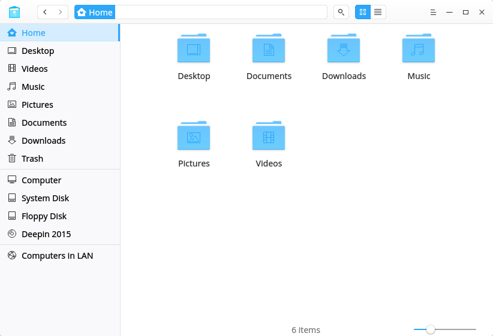
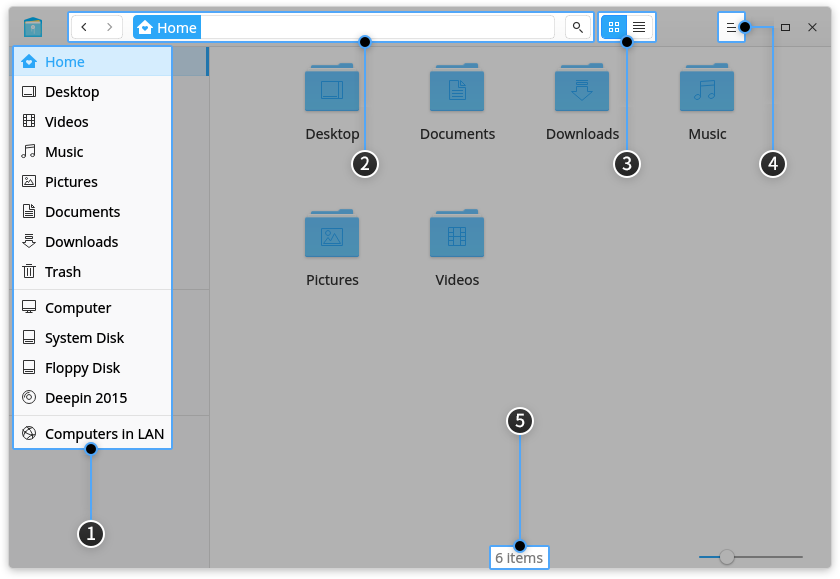
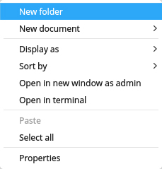

# Deepin File Manager|../common/deepin-file-manager.svg|

## Visão global

Deepin File Manager é desenvolvido pela equipe da Deepin Technology. Como o componente principal para gerenciar arquivos no deepin, é um gerenciador de arquivos poderoso e fácil de usar com uma interface elegante e simples. Com todos os recursos, bem projetado, eficiente e aprimorado, o Deepin File Manager será uma boa ajuda em sua vida diária e no trabalho.

## Guia

Você pode executar, fechar e criar um atalho para o Deepin File Manager das seguintes maneiras.

### Execute o Deepin File Manager

1. Clique em  ou mova o ponteiro do mouse para o canto superior esquerdo da tela para entrar na interface do Launcher.
2. Localize  rolando a roda do mouse ou pesquisando por "deepin file manager" na interface do Launcher.
3. Clique com o botão direito em , você pode
  - Clique em **Enviar para a área de trabalho** para criar um atalho na área de trabalho.
  - Clique em **Enviar para encaixar** para corrigir o aplicativo no encaixe.
  - Clique em **Adicionar à inicialização** para adicionar o aplicativo à inicialização, ele será executado automaticamente quando o sistema for inicializado.
 - 
> : No Centro de Controle, você pode definir o Gerenciador de Arquivos do Deepin como o gerenciador de arquivos padrão. Operações específicas referem-se a [Configurações padrão do aplicativo](dman:///dde#Default Application Settings).

### Sair do Deepin File Manager

- Na interface do Deepin File Manager, clique em  para sair.
- Clique com o botão direito do mouse em  no Dock, selecione **Fechar tudo** para sair do Deepin File Manager.
- Clique em  e selecione **Sair** para sair do Deepin File Manager.

## Interface Principal

Na interface do Deepin File Manager, os usuários podem executar várias operações com as barras funcionais. Ele é projetado para ser fácil de usar, amigo do usuário e eficiente.

<table class="block1">
    <caption></caption>
    <tbody>
        <tr>
            <td width="20px">1</td>
            <td width="90px">Barra de navegação</td>
            <td>Exibe o diretório do usuário, discos montados, marcadores e tags.</td>
        </tr>
        <tr>
            <td>2</td>
            <td>Barra de endereço</td>
            <td>Insira palavras-chave para pesquisar ou inserir o caminho do diretório para acessar o conteúdo correspondente. Use [anterior](icon/previous.png)  para voltar ou avançar. Use a barra de navegação para alternar entre diretórios pai e subdiretórios.</td>
        </tr>
        <tr>
            <td>3</td>
            <td>Visualização</td>
            <td>O usuário pode alternar os modos de visualização clicando em  e .</td>
        </tr>
        <tr>
            <td>4</td>
            <td>Menu principal</td>
            <td>O usuário pode criar uma nova janela, alternar para o tema escuro, definir a senha do compartilhamento, definir configurações, exibir informações de manual e de aplicativo e sair do aplicativo.</td>
        </tr>
        <tr>
            <td>5</td>
            <td>Barra de status</td>
            <td>Exibe o número de arquivos ou arquivos selecionados. O usuário pode arrastar o controle deslizante para ajustar o tamanho dos ícones no diretório.</td>
        </tr>
    </tbody>
</table>

> : O usuário pode arrastar a linha de separação à direita da barra de navegação para alterar sua largura.

## Funções básicas

Deepin File Manager é caracterizado com as funções básicas como um gerenciador de arquivos, o usuário pode facilmente criar, copiar, renomear ou excluir arquivos / pastas com ele.

### Novo documento/Pasta

#### Nova Pasta

1. Na interface do Deepin File Manager, clique com o botão direito e selecione **Nova pasta**.
2. Introduza um nome para a nova pasta e prima  ou clique na área em branco.

